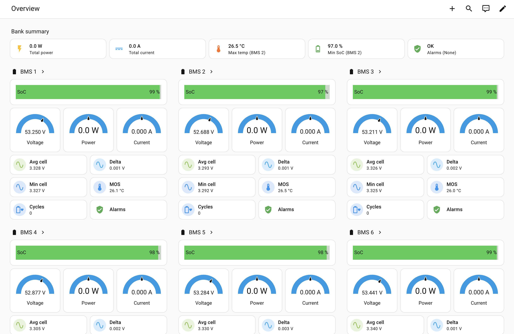
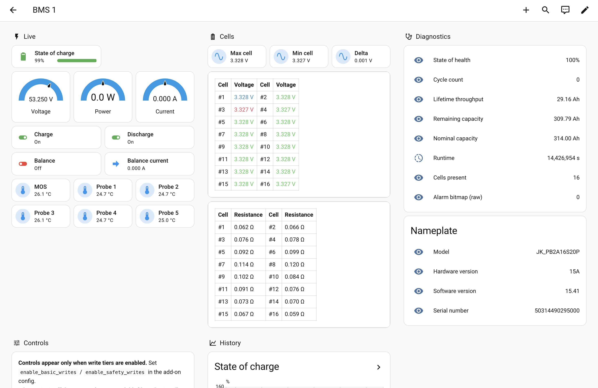
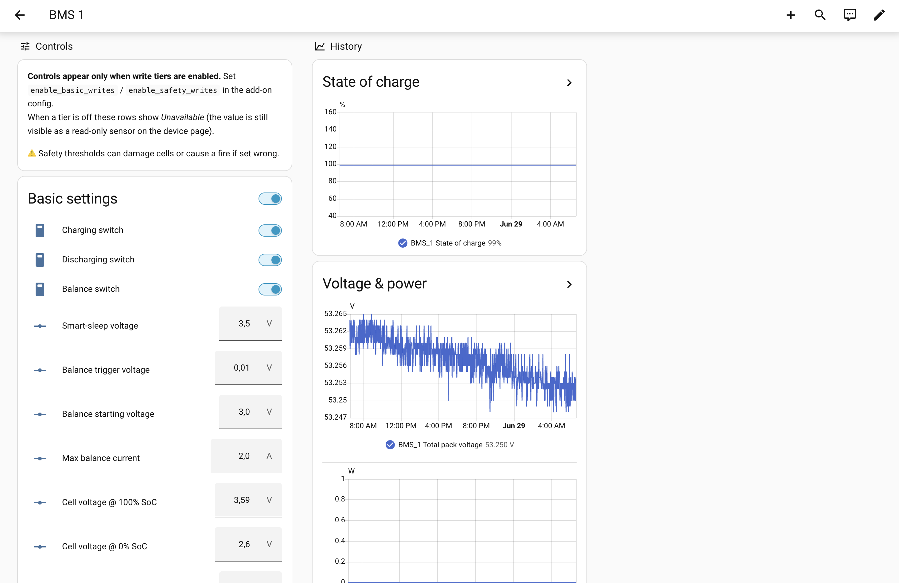

# jkbms2mqtt — JK-BMS battery monitoring for Home Assistant



Bring your **JK-BMS battery bank into Home Assistant**. This add-on reads every
pack over RS485 (Modbus) and publishes live data to MQTT with auto-discovery —
per-cell voltages and resistances, temperatures, state of charge / health,
balancing, cycle counts and alarms — for a single pack or a whole multi-pack
array. It ships a **ready-made dashboard** (the one above) that the add-on
installs for you, and optional, safety-gated controls to change BMS settings
from Home Assistant.

## What you get

- **Every pack as a Home Assistant device** — all entities auto-discovered, no
  YAML to write.
- **A ready-made multi-pack dashboard** the add-on writes for you and keeps in
  sync: a bank summary (total power/current, hottest pack, lowest SoC, alarms)
  plus a detail page per pack with cells, temperatures, and history.
- **Safe by default** — every BMS setting is *visible*; you opt in (per tier) to
  make basic or safety-critical settings *editable*.
- **Multi-pack** — up to 15 packs on one bus, over a TCP gateway or USB-RS485.

|  |  |
|---|---|
|  |  |

## Requirements

- **Home Assistant** with an MQTT broker (the *Mosquitto broker* add-on is the
  easy choice).
- One or more **JK-BMS** packs with **UART1 protocol set to `001 — JK BMS RS485
  Modbus V1.0`** and unique DIP-switch addresses (`1..15`).
- A **serial-over-IP gateway** (Elfin EW10/EW11, USR-W630, Waveshare, …) **or** a
  **USB-to-RS485 adapter** between the bus and Home Assistant.

See the [add-on manual](jkbms2mqtt/DOCS.md) for wiring diagrams and the full
hardware checklist.

## Get started

### 1. Add the repository to Home Assistant

1. **Settings → Add-ons → Add-on Store → ⋮ → Repositories**.
2. Paste `https://github.com/basmeerman/jkbms2mqtt` and click **Add**.
3. The **jkbms2mqtt** add-on appears in the store — install it.

### 2. Configure and start

In the add-on **Configuration**:

- **TCP gateway:** `transport: tcp_gateway` + `gateway_host` / `gateway_port`
  (gateway in *transparent* mode, not Modbus-TCP). **USB:** `transport:
  usb_serial` + `jkbms_path`.
- `bms_ids`: your DIP-switch addresses, e.g. `1,2,3,4,5,6`.
- Leave `install_dashboard: true` (default); set `dashboard_cells` to your pack
  size if it isn't 16.

**Start** the add-on. Within a poll cycle, **Settings → Devices** lists
`BMS_1 … BMS_n` with all their entities — no dashboard YAML needed for this.

### 3. Install the dashboard cards (once)

Via [HACS](https://hacs.xyz/) → Frontend, install **Mushroom**, **bar-card**,
**entity-progress-card**, **stack-in-card**, then **restart Home Assistant**.

### 4. Show the dashboard (one-time config block)

The add-on has already written `<config>/jkbms2mqtt/dashboard.yaml` +
`packages/jkbms_aggregates.yaml`. Add this to `configuration.yaml` and restart HA:

```yaml
homeassistant:
  packages: !include_dir_named jkbms2mqtt/packages
lovelace:
  dashboards:
    jkbms2mqtt:
      mode: yaml
      title: JK-BMS
      icon: mdi:battery
      show_in_sidebar: true
      filename: jkbms2mqtt/dashboard.yaml
```

A **JK-BMS** dashboard appears in the sidebar — bank summary + a tile per pack,
each linking to a detail page. Change `bms_ids` later and restart the add-on;
the dashboard regenerates with no re-paste.

> **Already running an older build?** If your entity ids look like
> `sensor.bms_1_total_pack_voltage` (rather than `…_device_…`), see the
> [dashboards guide](dashboards/README.md#two-ways-to-install) for the
> matching dashboard.

That's it. To make settings editable, enable `enable_basic_writes` /
`enable_safety_writes` (⚠️ safety thresholds can damage cells — see the
[add-on manual](jkbms2mqtt/DOCS.md#writes)).

## Documentation

**Using it**
- 📖 [Add-on manual](jkbms2mqtt/DOCS.md) — wiring, every config option,
  the dashboard, writes, troubleshooting. (Also shown in HA's add-on
  *Documentation* tab.)
- 📊 [Dashboards](dashboards/README.md) — what the dashboard shows, manual
  install, and customising it.

**Reference**
- [Entity reference](jkbms2mqtt/docs/ENTITIES.md) — every published entity, its
  unit, and which write tier (if any) controls it.
- [MQTT topics & write-tier policy](MIGRATION.md) — topic naming and the
  two-tier write-safety model.

**For contributors**
- [Contributing & developer guide](CONTRIBUTING.md) — architecture, dev setup,
  tests/CI, and the protocol-verification docs.

## License

MIT — see [`LICENSE`](LICENSE). The wiring images under
[`jkbms2mqtt/docs/wiring/`](jkbms2mqtt/docs/wiring/) are reused from
[phinix-org/Multiple-JK-BMS-by-Modbus-RS485](https://github.com/phinix-org/Multiple-JK-BMS-by-Modbus-RS485)
under the Apache License 2.0.
