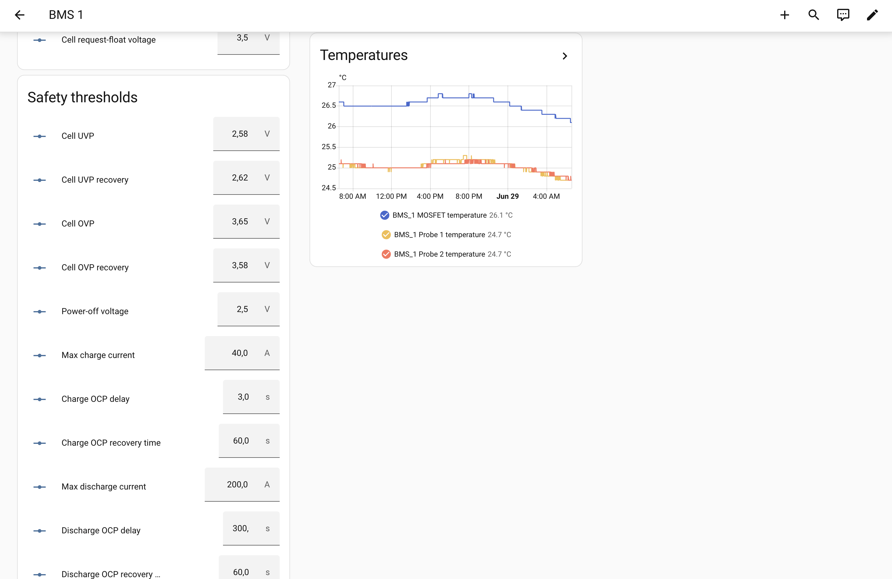
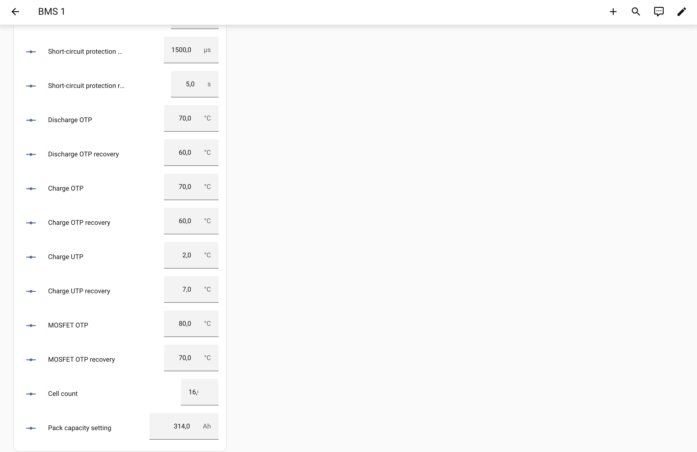

# Home Assistant dashboards for jkbms2mqtt

Generated, static Lovelace dashboards for the packs published by this add-on.
One **Overview** of every pack plus a per-pack **detail subview** (Live, Cells,
Diagnostics, Controls, History).

They target **this bridge's** entity ids, verified against a live install, and
are *not* compatible with other JK-BMS add-ons that name entities differently.
See [`PLAN.md`](PLAN.md) for the design and the entity-naming map.

## What it looks like

### Overview — the whole bank at a glance


A full-width **Bank summary** row — total power, total current, hottest pack,
lowest-SoC pack, and an alarm indicator (temperature / SoC / alarm each name the
reporting BMS) — sits above one tile per pack: SoC bar, Voltage / Power / Current
gauges, average / delta / min cell, MOS temperature, cycle count, and an alarm
chip. Tap a pack heading to open its detail page.

Every tile starts with a **Last seen** row ("Last seen · 12 seconds ago"). Its
icon is green while data is arriving and fades linearly to grey over 5 minutes
without a successful poll, so a pack that dropped off the bus stays on screen,
visibly greyed out, instead of silently showing old numbers. Only packs that
have *never* reported are hidden.

### Per-pack detail

Each pack opens a subview with five sections. **Live**, **Cells** (a colour-coded
per-cell voltage table — highest cell blue, lowest red — plus a resistance table),
and **Diagnostics** + **Nameplate**:


Scrolling down: **Controls** (every BMS setting with its current value —
editable `number`/`switch` rows when the add-on's write tier is on, read-only
rows otherwise) and **History** graphs:





## Two ways to install

- **Auto-install (recommended, new installs).** The add-on writes this
  dashboard + package into `<config>/jkbms2mqtt/` on startup
  (`install_dashboard: true`, the default) and a one-time `configuration.yaml`
  block shows it in the sidebar — self-updating, no re-paste. See
  [DOCS.md → Dashboard](../jkbms2mqtt/DOCS.md#dashboard). You still install the
  HACS cards (below).
- **Manual generate + paste (this folder).** Use the generator directly if you'd
  rather not let the add-on write to your config dir, or you want to tweak the
  YAML. Steps 1–4 below.

### Entity ids

Home Assistant builds each id from the device name plus the entity name, so
`BMS_1` + "Total voltage" gives `sensor.bms_1_total_voltage`. The generator
derives the same ids from the bridge's entity table, so both always agree.

Installs from before 2.2.0 keep the ids they registered back then
(`sensor.bms_1_total_pack_voltage`, or `sensor.bms_1_device_total_voltage`),
because HA never renames an existing entity. Check one id under **Settings →
Devices → BMS 1**; if it doesn't match, run `scripts/rename_entities.py` once
(see [MIGRATION.md](../MIGRATION.md#entity-ids)).

## 1. Generate the YAML

The dashboard is generated from your actual `bms_ids` so non-contiguous ids and
mixed pack sizes are handled.

```sh
# all packs 16s
python dashboards/generate.py --bms-ids 1,2,3,4,5,6 --cells 16

# non-contiguous ids, different cell counts per pack
python dashboards/generate.py --bms-ids 1,3,7 --cells 1=16,3=8,7=24

# write tiers on in the add-on: pass the same tiers
python dashboards/generate.py --bms-ids 1,2,3,4,5,6 --cells 16 --basic-writes --safety-writes
```

The tier flags must match `enable_basic_writes` / `enable_safety_writes` in the
add-on options (both off by default), because a setting is a `number`/`switch`
only while its tier is on and a `sensor`/`binary_sensor` otherwise.

Requires Python 3 + PyYAML (`pip install pyyaml`) — a generator-time tool only,
nothing extra runs in the add-on. Outputs:

- `out/jkbms2mqtt-dashboard.yaml` — paste into the dashboard Raw config editor.
- `packages/jkbms_aggregates.yaml` — an HA *package* (see step 4).
- `out/verify-entities.jinja` — paste into **Developer Tools → Template** to
  confirm the bridge created the exact entity ids this dashboard expects,
  **before** importing. See [`TESTPLAN.md`](TESTPLAN.md) for the full
  verification procedure (start here).

## 2. Install the HACS frontend cards

The dashboard uses these custom cards — install each via [HACS](https://hacs.xyz/)
→ Frontend, then **restart Home Assistant**:

| Card | Used for |
|---|---|
| **Mushroom** | Charge / discharge / balance state tiles, cell stats, alarm chip |
| **bar-card** | SoC bar on the Overview tiles |
| **entity-progress-card** | SoC progress bar on the detail Live section |
| **stack-in-card** | Per-cell voltage / resistance tables |

History uses the built-in `history-graph` card (no HACS needed). Gauges,
`entities`, `grid`, `heading`, `markdown`, `sections` are all core.

## 3. Import the dashboard

1. **Settings → Dashboards → + Add Dashboard → New dashboard from scratch**, save.
2. Open it, top-right ⋮ → **Edit dashboard** → ⋮ → **Raw configuration editor**.
3. Replace the contents with `out/jkbms2mqtt-dashboard.yaml`. Save.

Overview tiles only render for packs that have reported at least once
(`sensor.bms_<n>_last_seen` is neither `unknown` nor `unavailable`), so
unused ids stay hidden while a pack that goes silent stays visible and greys
out. Tap a pack's heading to open its detail subview, whose **Live** section
shows the same freshness row plus the exact time of the last successful poll.

All ids come from the entity names, so they match a 2.2.0-or-newer install
exactly; an older install migrates with `scripts/rename_entities.py`.

## 4. Install the aggregates package (optional but recommended)

The bridge publishes **per-pack only** — there is no bank-wide alarm or total.
`packages/jkbms_aggregates.yaml` adds them as HA template entities:

- `binary_sensor.jkbms_any_alarm` — ON if any pack has active alarms.
- `sensor.jkbms_bank_total_power`, `…_bank_min_soc`, `…_bank_max_temp`.

Enable packages once in `configuration.yaml`:

```yaml
homeassistant:
  packages: !include_dir_named packages
```

Copy `jkbms_aggregates.yaml` into `<config>/packages/` and restart HA.

## Notes & caveats

- **Controls (writes) are tier-gated.** With a tier off, its rows reference the
  read-only `sensor.*` / `binary_sensor.*` entities; with it on, the editable
  `number.*` / `switch.*` ones. The auto-installed dashboard follows the add-on
  options on every restart; after changing a tier, **re-generate a manual
  dashboard** with the matching `--basic-writes` / `--safety-writes` flags and
  re-paste. ⚠️ Safety thresholds can damage cells if set wrong.
- **Older installs need one migration.** Entity ids registered before 2.2.0
  don't match this dashboard; `scripts/rename_entities.py` migrates them, and
  `out/verify-entities.jinja` confirms the result.
- **Re-generate after changing `bms_ids` or cell counts** and re-paste.
- **Five temperature probes** are shown (`probe_1..5`); unused probes show
  Unavailable. Unverified fields (`heating`, packed-bit toggles) are excluded.

## CI drift guard

The `dashboards` CI job (`.github/workflows/ci.yml`) keeps this folder honest on
every push/PR:

1. **Lint** `generate.py` + `check_entities.py` with the repo's ruff config.
2. **Sync** — regenerates the YAML and fails if the committed `out/` /
   `packages/` differ (someone edited the generator but didn't regenerate).
3. **Entity drift** — `check_entities.py` reconciles the
   dashboard's references against the bridge's own entity table
   (`jkbms2mqtt.entities`) at the `(domain, object_id)` level, in **both** naming
   modes, and fails if the bridge adds/removes/renames an entity the dashboard
   doesn't track, or the dashboard references an entity the bridge no longer
   publishes.

Run the guard locally:

```sh
python dashboards/generate.py --bms-ids 1,2,3,4,5,6 --cells 16  # then check it's unchanged
python dashboards/check_entities.py
```

It catches *set* drift (added/removed/renamed entities). It cannot catch a
description-text change that only alters an HA entity slug — the deployed
naming isn't reproducible from source — so for that, run
`out/verify-entities.jinja` against a live instance.
