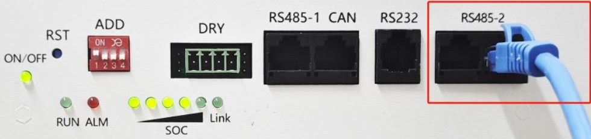
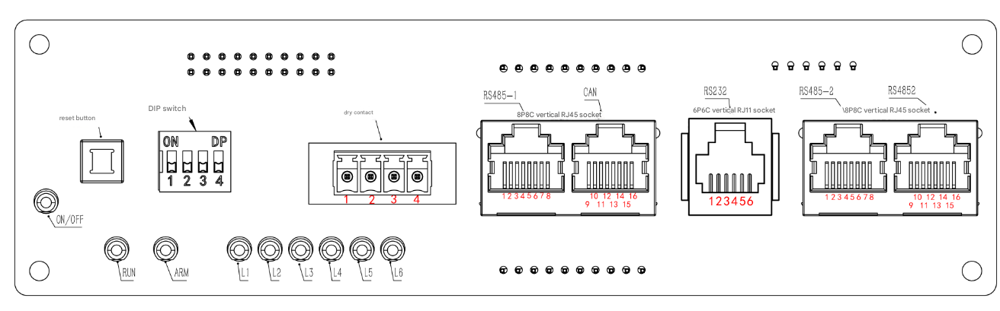
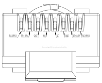
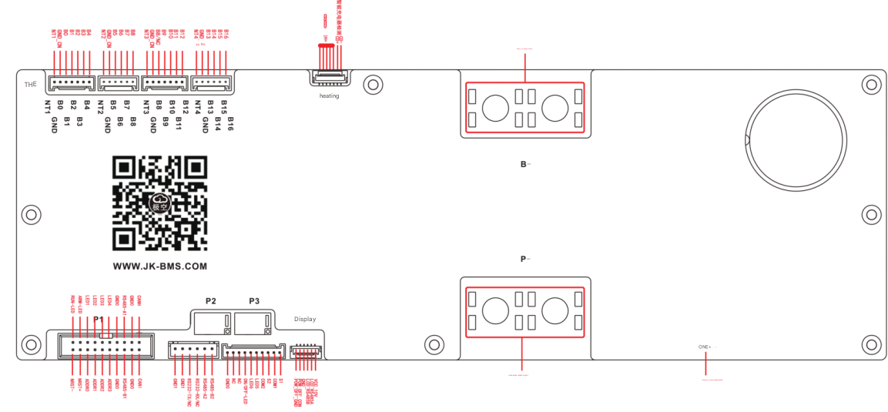
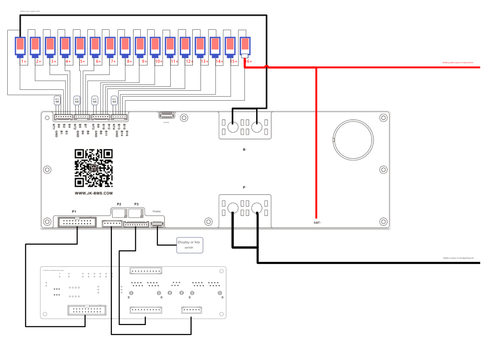

# jkbms2mqtt

A Python service that reads one or more JK-BMS battery packs over RS485 using
the standard **JK BMS RS485 Modbus V1.0 / V1.1** protocol and publishes their
telemetry to MQTT with Home Assistant auto-discovery.

## Before you start

- **Firmware**: every BMS must run firmware ≥ 19 (any recent JK-BMS).
- **UART1 protocol** on every BMS: set to `001 — JK BMS RS485 Modbus V1.0` via
  the BMS display or BLE app.
- **DIP switches**: each BMS gets a *unique* address 1..15 on its DIP-switch
  bank. (Avoid address 0 — that's master-mode and is not used here.)
- **Termination**: a 120 Ω resistor at each end of the RS485 bus.
- **Common ground**: all BMS GND pins tied together, and to the RS485 adapter
  / gateway GND.

## Wiring

The relevant connectors are on the JK-BMS communication board. Use **UART1**
(the RJ45 jack) for daisy-chaining multiple BMSes.

| | |
|-|-|
| Comm-board overview |  |
| Comm-board pinout   |  |
| UART1 RJ45 cable    |  |
| Main-board layout   |  |
| Daisy-chain wiring  |  |

Two supported transports between the bus and this add-on:

- **TCP gateway** — a serial-over-IP bridge (Elfin EW10/EW11, USR-W630,
  Waveshare, ser2net, etc.) connected to the same network as Home Assistant.
  Set the gateway to *transparent* mode (NOT Modbus-TCP); this add-on speaks
  RTU and the gateway just passes bytes through.
- **USB serial** — a USB-to-RS485 adapter (FT232, CH340, CP2102) plugged into
  the HA host. The add-on opens it as a serial port.

## Add-on configuration

| Option | Default | Notes |
|---|---|---|
| `transport` | `tcp_gateway` | Dropdown: `tcp_gateway` or `usb_serial`. |
| `gateway_host` | `192.168.1.100` | IP / hostname of the TCP-RS485 gateway. |
| `gateway_port` | `502` | TCP port of the gateway. |
| `jkbms_path` | `/dev/ttyUSB0` | Serial device path when `transport: usb_serial`. |
| `bms_ids` | `[1]` | List of Modbus slave addresses (DIP-switch IDs) on the bus. E.g. `[1, 2, 3, 4, 5, 6]` for a 6-pack array; non-contiguous like `[2, 5, 7]` is fine. |
| `topology` | `master_poll` | Dropdown. (Currently the only mode for this protocol.) |
| `poll_interval_s` | `5.0` | Seconds between poll cycles. |
| `mqtt_host` | `core-mosquitto.local.hass.io` | The HA Mosquitto broker. |
| `mqtt_port` | `1883` | |
| `mqtt_user` / `mqtt_password` | empty | Only needed if your broker requires auth. |
| `discovery_prefix` | `homeassistant` | HA MQTT discovery prefix. |
| `bms_name_prefix` | `BMS` | Devices appear as `BMS_<n>`. |
| `enable_basic_writes` | `false` | Allow writes to operational settings (charge/discharge/balance switches, balance thresholds, etc.). Off by default. |
| `enable_safety_writes` | `false` | Allow writes to safety-critical thresholds (OVP/UVP, max charge/discharge current, OTP/UTP). Off by default — a wrong value here can damage cells. |
| `log_level` | `info` | Dropdown: `debug`, `info`, `warning`, `error`. |
| `recording_enabled` | `false` | When on, every Modbus transaction is logged to the add-on log at DEBUG (no separate file). |

## Verifying it works

After Start, the add-on log should show one `INFO` line per BMS with its
model / FW version / serial, then steady-state polling output.

From any host with `mosquitto_sub` (the HA Mosquitto add-on includes it):

```bash
mosquitto_sub -h <broker> -t 'BMS_+/Total_Voltage_V'
```

You should see a value (e.g. `53.250`) within roughly one `poll_interval_s`
for every BMS that's responding.

Devices appear under **Settings → Devices** as `BMS_1`, `BMS_2`, …, one per
configured `bms_ids` entry.

## Writes

When `enable_basic_writes` is on, HA gains `number` and `switch` entities for
the operational parameters. Toggle them as usual; the bridge translates each
to a Modbus 0x10 write to the BMS and echoes the new value to the state topic.

When `enable_safety_writes` is on, the protection-threshold parameters
(OVP/UVP, OCP delays, OTP/UTP) become writable too. **A wrong value here can
damage the cells or pose a fire risk** — leave off unless you know exactly
what you're changing.

A rejected write (out-of-range value, BMS error, transport failure) produces a
JSON message on `<bms_name>/error`, e.g.:

```json
{"param": "max_charge_current", "reason": "value 700.0 outside [0, 600]"}
```

## Troubleshooting

- **No data, only one BMS responding** — usually means UART1 protocol is set
  to something other than `001`, or the DIP-switch ID conflicts between two
  BMSes. Set `recording_enabled: true` and look for Modbus exception responses
  in the log.
- **`Connect attempt N failed: …`** — the TCP gateway IP / port is wrong, or
  the gateway is in Modbus-TCP mode instead of transparent.
- **`block A returned Modbus error`** — the BMS rejected the read. Most often
  this is the protocol-001 setting; sometimes a fresh BMS hasn't finished
  booting yet.
- **`block B / block C` debug-level errors** — non-fatal. Some BMS firmware
  versions have a memory hole at `0x1278..0x12EF` so block B reads fail; the
  bridge fills in zeros and the add-on still publishes everything in block A.

## License

MIT. Wiring images included under Apache 2.0 from
[phinix-org/Multiple-JK-BMS-by-Modbus-RS485](https://github.com/phinix-org/Multiple-JK-BMS-by-Modbus-RS485).
